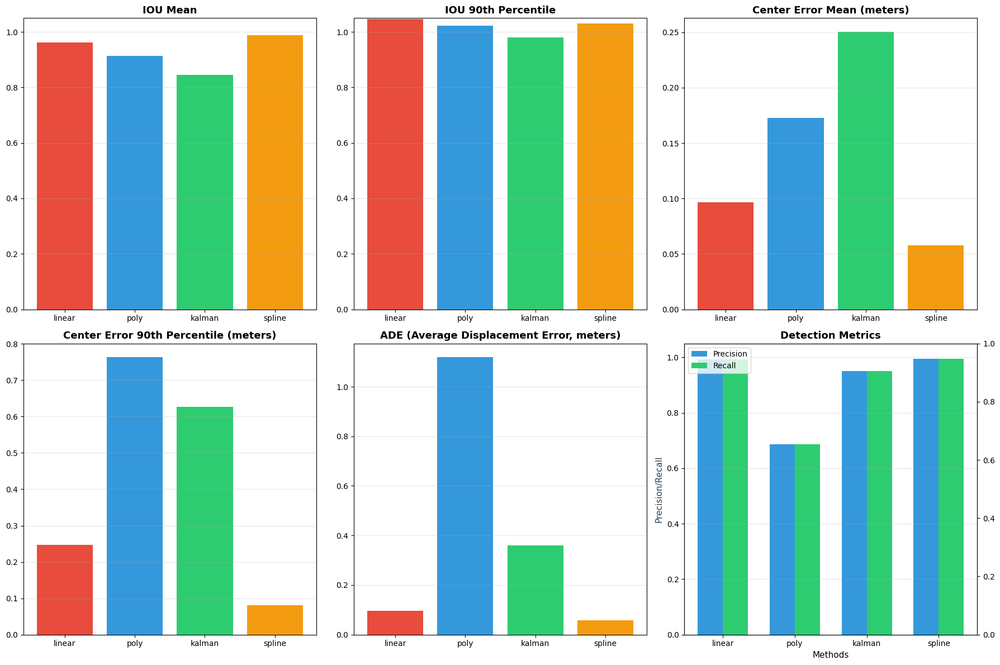
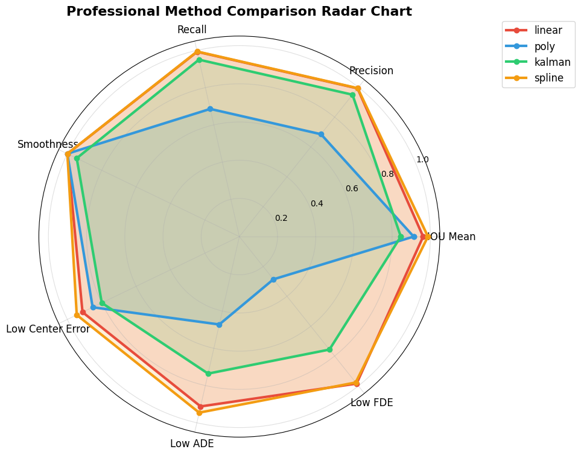
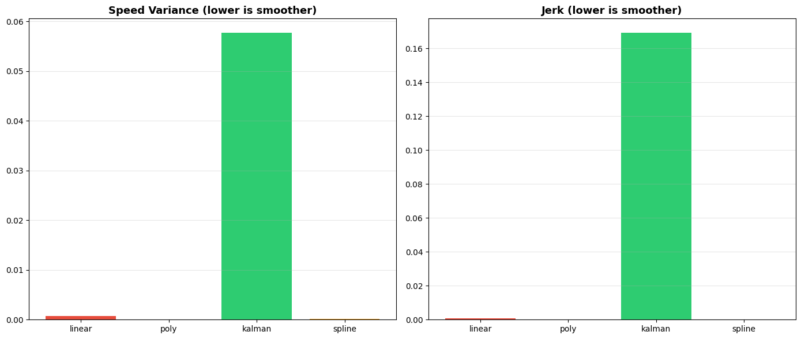

# BEV 2D Box 关键帧预标注递推补帧评测工程方案



---

## 一、工程背景与问题概述

### 1. 业务痛点

自动驾驶 / BEV 感知数据集**人工预标注仅标注少量关键帧（Key Frame）**，中间大量普通帧无人工真值；业界常用**轨迹递推 / 插值 / 光流 / 卡尔曼滤波**方式由关键帧生成中间帧 BEV 2D Car Box，替代逐帧人工标注。

### 2. 核心问题

- 关键帧 Box 人工标注**完全可信**，中间帧由算法递推生成；

- 需**定量评测 + 可视化对比**：不同递推算法生成的中间帧 Box 和**全帧真值数据集**的偏差、检测精度；

- 无原始点云 / 图像输入，**仅基于 BEV 2D Box 坐标做后处理递推 + 评测 + 可视化**。

### 3. 输入输出约束

- 输入：仅帧序列、每帧 BEV 2D Car Box（关键帧标注框、全帧真值 Box），**无需原图 / 点云**；

- 输出：多类递推算法补帧结果、量化评测指标、对比可视化结果、完整工程文档。

---

## 二、评测结果速览

### 2.1 可视化视频

点击播放可视化对比视频：

[](output/vis/bev_interp_video.mp4)

### 2.2 雷达图对比



### 2.3 关键指标对比

| 方法     | IOU@mean | CE@mean(m) | ADE(m)  | Prec  | Jerk  |
|----------|----------|------------|---------|-------|-------|
| linear   | 0.9625   | 0.0968     | 0.0962  | 0.9927| 0.0581|
| poly     | 0.9129   | 0.1726     | 1.1186  | 0.6857| 0.0785|
| kalman   | 0.8454   | 0.2503     | 0.3589  | 0.9503| 0.0309|
| spline   | 0.9877   | 0.0578     | 0.0575  | 0.9942| 0.0092|

---

## 三、整体工程架构

```Plain Text
输入数据加载 (input/)
       ↓
数据预处理模块
       ↓
多算法Box递推补帧模块（Linear / Poly / Kalman / Spline）
       ↓
评测指标计算模块（15+个专业指标）
       ↓
结果可视化模块（视频 + 对比图 + 雷达图）
       ↓
评测报告输出 (output/)
```

---

## 四、数据预处理模块设计

### 1. 数据格式定义

统一 BEV 2D Car Box 标准字段：

```json
{
  "frame_id": 帧序号,
  "is_key_frame": 是否关键帧(true/false),
  "category": "car",
  "bbox_bev_2d": [x1, y1, x2, y2, x3, y3, x4, y4],  # BEV鸟瞰图2D框4个角点坐标（米）
  "score": 标注置信度,
  "track_id": 目标跟踪ID(同辆车连续帧唯一ID),
  "center": [x, y],  # 中心坐标（米）
  "yaw": 航向角（弧度）,
  "speed": 速度（m/s）,
  "dimensions": [w, l]  # 宽度和长度（米）
}
```

### 2. 数据划分

- **Key Frame 集**：人工标注、视为 100% 真值（本工程每4帧1个关键帧）；

- **Inter Frame 集**：关键帧之间的待递推中间帧；

- **Full GT 数据集**：每一帧都有人工真值（合成生成），作为评测基准。

### 3. 预处理流程

1. 按`track_id`拆分同辆车的帧序列；
2. 按`frame_id`时间排序，切分关键帧区间；
3. 过滤异常框（坐标越界、宽高为0、重复框）；
4. 规整帧间隔，统一采样步长。

---

## 五、主流中间帧 Box 递推方法实现（核心）

仅基于**帧序列 + 关键帧 Box 坐标**做纯后处理递推，无需图像 / 点云特征，实现 4 类常用方法：

### 方法 1：线性插值递推（Linear Interpolation）

- 原理：对同一`track_id`相邻两个关键帧的**框中心坐标(x,y)、航向角yaw、速度speed**做帧间线性等比例插值；
- 适用：车辆匀速直线运动场景；
- 缺点：转弯、变速误差大。
- 实现文件：`interp_method/linear_interp.py`

### 方法 2：二次多项式插值（Quadratic Polynomial）

- 原理：用前后多关键帧（3个）拟合二次曲线，预测中间帧 Box 位置；
- 适用：车辆匀变速、平缓转向；
- 缺点：对噪声敏感；
- 实现文件：`interp_method/poly_interp.py`

### 方法 3：卡尔曼滤波轨迹平滑递推（Kalman Filter）

- 状态量：Box 中心坐标、速度(vx,vy)、航向角、航向变化率、框宽高；
- 观测值：仅关键帧人工 Box；
- 流程：关键帧观测更新，中间帧状态预测递推；
- 优势：抗标注抖动、运动轨迹更平滑；
- 实现文件：`interp_method/kalman_filter.py`

### 方法 4：样条插值（Spline Interpolation）

- 原理：三次样条拟合关键帧轨迹，连续生成中间帧平滑 Box；
- 优势：非线性运动、转弯场景拟合效果最优；
- 注：使用未来信息，作为离线参考上限；
- 实现文件：`interp_method/spline_interp.py`

> 工程可灵活扩展：新增任何插值 / 滤波递推方法，只需统一输入输出 Box 格式。

---

## 六、评测方法与指标设计

以**全帧人工真值 Full GT**为基准，对比各递推方法生成的中间帧 Box 精度。

### 1. 核心评测指标（15+个专业指标）

#### （1）检测精度类

- **mAP@0.5 / mAP@0.75**：Car 类别 BEV 2D 框 AP，IOU 阈值 0.5/0.75；
- **Precision / Recall**：逐帧递推框与 GT 匹配精度、召回率。

#### （2）IOU 类指标

- **iou_mean**：所有帧 IOU 的平均值；
- **iou_std**：IOU 的标准差（稳定性）；
- **iou_median**：IOU 的中位数；
- **iou_90_percentile**：IOU 的90分位数。

#### （3）位置偏差类

- **center_error_mean**：Box 中心点平均 L2 距离（米）；
- **center_error_std**：中心误差标准差；
- **center_error_90_percentile**：90分位中心误差；
- **corner_error_mean/std**：4个角点平均距离误差。

#### （4）尺寸与航向误差

- **width_error_mean/std**：宽度误差；
- **height_error_mean/std**：高度误差；
- **yaw_error_mean/std**：航向角平均绝对误差（弧度）。

#### （5）轨迹指标

- **ADE**：Average Displacement Error（平均位移误差）；
- **FDE**：Final Displacement Error（最终位移误差）；
- **trajectory_length_ratio**：预测轨迹长度与真实轨迹长度比值。

#### （6）平滑度指标（更适合递推效果评价）

- **speed_variance**：速度方差（越小越平滑）；
- **acceleration_variance**：加速度方差；
- **jerk**：加加速度（加速度的变化率，越小越平滑）。

### 2. 评测流程

1. 按`track_id`关联递推 Box 与 GT Box；
2. 计算逐帧 IOU、坐标误差、尺寸误差；
3. 统计整个序列 / 所有场景的 mAP、均值、方差；
4. 输出各方法指标对比表。

---

## 七、可视化模块实现

无原图依赖，**纯 BEV 俯视视角可视化**，支持单帧查看 + 序列视频导出。

### 1. 可视化内容

- 画布：BEV 鸟瞰平面坐标系（200m × 200m，10像素/米）；

- 绘制元素：

  1. **红色框**：Full GT 真值 Box；
  2. **绿色框**：线性插值递推 Box；
  3. **黄色框**：二次多项式插值递推 Box；
  4. **蓝色框**：卡尔曼滤波递推 Box；
  5. **橙色框**：样条插值递推 Box；
  6. **深灰色轨迹**：所有方法的统一历史轨迹；

- 附加：左上角方法图例，实时显示当前帧各方法 IOU、中心误差。

### 2. 输出形式

- **帧序列对比视频**（mp4）：`output/vis/bev_interp_video.mp4`；
- **指标对比图**（png）：`output/vis/metrics_comparison.png`（2×3子图，包含IOU、误差、ADE、Precision/Recall）；
- **平滑度指标图**（png）：`output/vis/metrics_comparison_smoothness.png`（速度方差、Jerk）；
- **雷达图**（png）：`output/vis/radar_chart.png`（7维度专业对比）；
- **逐帧指标图**（png）：`output/vis/frame_metrics.png`。

---

## 八、合成测试场景设计

本工程包含合成的真实场景数据，覆盖多种运动模式：

| Track ID | 运动模式 | 特点 |
|----------|----------|------|
| 1 | 匀速直线 | 基础场景，测试插值能力 |
| 2 | 剧烈变速直线 | 含0速段，测试变速场景 |
| 3 | 匀速圆弧 | 测试转弯场景 |
| 4 | 曲线+剧烈变速 | 最复杂场景，含0速段和急加速 |

生成文件：`input/generate_synthetic_data.py`

---

## 九、工程目录结构（可直接落地）

```Plain Text
bev_box_interp_eval/
├── config/
│   └── config.yaml                 # 配置文件（帧间隔、IOU阈值、评测参数）
├── input/                          # 输入数据目录（已生成的合成数据）
│   ├── generate_synthetic_data.py  # 合成数据生成脚本
│   ├── key_frame_boxes.json        # 关键帧标注（约80个）
│   ├── full_gt_boxes.json          # 全帧真值（约800个）
│   └── data_metadata.json          # 数据元信息
├── preprocess/
│   └── data_preprocessor.py        # 数据预处理、数据解析、异常过滤
├── interp_method/                  # 各类递推算法实现
│   ├── linear_interp.py            # 线性插值
│   ├── poly_interp.py              # 二次多项式插值
│   ├── kalman_filter.py            # 卡尔曼滤波
│   └── spline_interp.py            # 样条插值
├── evaluation/
│   └── evaluator.py                # 评测指标实现（mAP/IOU/坐标误差/平滑度）
├── visualization/
│   └── visualizer.py               # BEV框绘制、单帧可视化、视频生成、指标图
├── utils/
│   ├── data_format.py              # 数据结构定义
│   └── iou_utils.py                # 通用工具（IOU计算、坐标转换）
├── output/                         # 运行结果目录（已生成的评测结果）
│   ├── box_result/                 # 各方法每帧递推 Box 结果
│   │   ├── linear_results.json
│   │   ├── poly_results.json
│   │   ├── kalman_results.json
│   │   └── spline_results.json
│   ├── eval_metric/                # mAP、IOU、误差指标表格
│   │   └── eval_results.json
│   ├── vis/                        # 对比截图、时序视频、指标折线图
│   │   ├── bev_interp_video.mp4
│   │   ├── metrics_comparison.png
│   │   ├── metrics_comparison_smoothness.png
│   │   └── radar_chart.png
│   └── eval_report.md              # 自动生成评测报告
├── run_pipeline.py                 # 一键运行全流程：预处理→递推→评测→可视化
└── README.md                       # 工程使用文档
```

---

## 十、完整使用文档说明（写给其他开发者）

### 1. 环境依赖

```bash
pip install numpy matplotlib opencv-python pyyaml
```

### 2. 数据准备

1. **使用已生成的合成数据（默认）**：`input/`目录下已包含生成好的关键帧和全帧真值数据；
2. **重新生成合成数据**：运行`python input/generate_synthetic_data.py`；
3. **使用真实数据**：整理关键帧标注 Box、全帧 GT Box，按指定 JSON 格式放入`input/`；
4. 配置修改：在`config/config.yaml`配置帧区间、IOU 阈值、选用的递推方法。

### 3. 运行流程

```bash
# 一键全流程：加载数据→预处理→多方法递推→评测→可视化→生成报告
python run_pipeline.py
```

Pipeline 执行步骤：
1. **数据预处理**：加载关键帧和真值，构建跟踪序列
2. **执行插值**：运行4种递推方法（Linear/Poly/Kalman/Spline）
3. **指标评估**：计算所有15+个专业评估指标
4. **可视化生成**：生成视频、指标对比图、雷达图
5. **报告生成**：输出完整的评估分析报告

### 4. 输出结果

- `output/box_result/`：各方法每帧递推 Box 结果（JSON格式）；
- `output/eval_metric/`：mAP、IOU、误差指标结果；
- `output/vis/`：对比视频、指标对比图、雷达图、逐帧指标图；
- `output/eval_report.md`：汇总各方法优劣、适用场景、量化数据的完整报告。

### 5. 扩展方式

- **新增递推算法**：在`interp_method/`新增文件，统一接口即可接入流水线；
- **新增评测指标**：在`evaluation/`新增指标计算函数，在`utils/data_format.py`中添加字段，自动加入报告；
- **适配其他类别**：只需修改类别过滤条件，支持 pedestrian/vehicle 等。

---

## 十一、方案结论与适用建议

1. 关键帧完全可信，中间帧无真值时，**用全帧人工 GT 作为离线评测基准**是最优方案；

2. 纯 Box 后处理无需图像 / 点云，工程轻量化、可直接落地数据集预标注补帧场景；

3. 可视化可直观看出：匀速场景线性插值足够，转弯 / 变速场景卡尔曼、样条插值效果显著更优；

4. 输出 mAP + 轨迹偏差 + 平滑度多维度指标，可定量选择最优递推算法用于量产数据集自动补帧。

---

## 十二、快速开始

```bash
cd /Users/rik/workspace/study/bev_box_interp_eval

# 运行完整Pipeline（使用已生成的合成数据）
python run_pipeline.py

# 查看生成的报告
cat output/eval_report.md
```

---

## 十三、输出结果预览

### 指标对比图


### 平滑度指标图


### 雷达图

