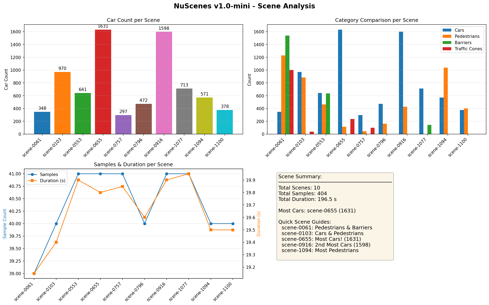

# NuScenes 数据集可视化 Demo


这个项目用于学习和可视化 **NuScenes 自动驾驶数据集**，提供环视相机和 BEV（鸟瞰图）视角的可视化功能。

---

## 📁 项目结构

```
demo_by_nuscenes/
├── data/
│   └── nuscenes/              # NuScenes 数据集（需自行下载）
│       ├── samples/
│       ├── sweeps/
│       ├── maps/
│       └── v1.0-mini/
├── utils/                     # 公共工具模块
│   ├── __init__.py
│   └── nuscenes_utils.py      # NuScenes 数据加载和处理工具
├── output/                    # 输出目录（已生成的可视化结果）
│   ├── surround_cams_*.png    # 环视相机图像
│   ├── bev_cars_only_*.png    # BEV视角图像
│   ├── combined_*.png         # 组合视图
│   ├── scene0_surround.gif    # 环视相机GIF
│   ├── scene0_bev.gif         # BEV视角GIF
│   ├── scene0_bev_annotated.gif # BEV带标注GIF
│   ├── scenes_analysis.png    # 场景分析图
│   └── scenes_video.mp4       # 场景视频
├── visualize_nuscenes.py      # 主可视化脚本（单帧）
├── generate_gif.py            # GIF动图生成
├── generate_video.py          # 视频生成
├── visualize_scenes.py        # 场景分析可视化
├── analyze_dataset.py         # 数据集分析
├── requirements.txt           # 依赖配置
└── README.md                  # 项目说明
```

---

## ✨ 功能特性

### 📷 组合视图
- **上方**：6个环视相机（2行3列布局）
  - CAM_FRONT, CAM_FRONT_LEFT, CAM_FRONT_RIGHT
  - CAM_BACK, CAM_BACK_LEFT, CAM_BACK_RIGHT

- **下方**：BEV视角的3D box真值
  - 位置（通过多边形位置体现）
  - 大小（宽w和长l）
  - 朝向（通过多边形旋转体现）
  - 速度（箭头表示）
  - 类别和实例ID（文字标签）

### 📊 分析工具
- 数据集统计分析（场景、样本、类别、传感器）
- 场景对比分析可视化

---

## 🚀 快速开始

### 1. 安装依赖

```bash
pip install -r requirements.txt
```

### 2. 准备数据

将 NuScenes 数据集下载到 `data/nuscenes/` 目录，默认使用 `v1.0-mini` 版本。

目录结构：
```
demo_by_nuscenes/
└── data/
    └── nuscenes/
        ├── samples/
        ├── sweeps/
        ├── maps/
        └── v1.0-mini/
            ├── sample_data.json
            ├── sample_annotation.json
            └── ...
```

### 3. 运行脚本

| 脚本 | 功能 | 命令 |
|------|------|------|
| `visualize_nuscenes.py` | 生成单帧组合视图 | `python visualize_nuscenes.py` |
| `generate_gif.py` | 生成场景GIF动图 | `python generate_gif.py` |
| `generate_video.py` | 生成场景视频 | `python generate_video.py` |
| `visualize_scenes.py` | 场景分析可视化 | `python visualize_scenes.py` |
| `analyze_dataset.py` | 数据集统计分析 | `python analyze_dataset.py` |

---

## 🎨 BEV 视角显示信息

| 元素 | 说明 |
|------|------|
| 🔴 红色方块 | 自车(Ego Vehicle) |
| 🔵 青色框 | vehicle.car |
| 🟣 洋红框 | vehicle.truck |
| 🟢 绿色框 | vehicle.bus |
| 🔷 蓝色框 | pedestrian |
| ⬜ 白色框 | 其他类别 |
| ↗️ 箭头 | 运动方向和速度 |
| 文字标签 | 类别、实例ID、尺寸 |

---

## 📝 公共工具模块

`utils/nuscenes_utils.py` 提供以下功能：

- `load_nuscenes()` - 加载 NuScenes 数据集
- `get_sensor_order()` - 获取相机布局顺序
- `project_box_to_bev()` - 将3D box投影到BEV坐标系
- `is_box_in_range()` - 检查box是否在BEV范围内
- `get_category_color()` - 获取类别颜色映射
- `get_sample_data_path()` - 获取传感器数据路径
- `get_ego_pose()` - 获取自车姿态
- `iter_scene_samples()` - 迭代场景中的样本

---

## 📄 输出文件

运行脚本后，输出保存在 `output/` 目录：

| 文件 | 说明 |
|------|------|
| `surround_cams_*.png` | 环视相机图像 (1790×893) |
| `bev_cars_only_*.png` | BEV视角图像 (1790×1790) |
| `combined_*.png` | 组合视图图像 |
| `scene0_surround.gif` | 环视相机GIF |
| `scene0_bev.gif` | BEV视角GIF |
| `scene0_bev_annotated.gif` | BEV带标注GIF |
| `scenes_analysis.png` | 场景分析统计图 |
| `scenes_video.mp4` | 场景视频 |

---

## 📊 示例输出

### 组合视图


### 场景分析


---

## 📚 参考资料

- [NuScenes Dataset](https://www.nuscenes.org/)
- [NuScenes DevKit](https://github.com/nutonomy/nuscenes-devkit)
